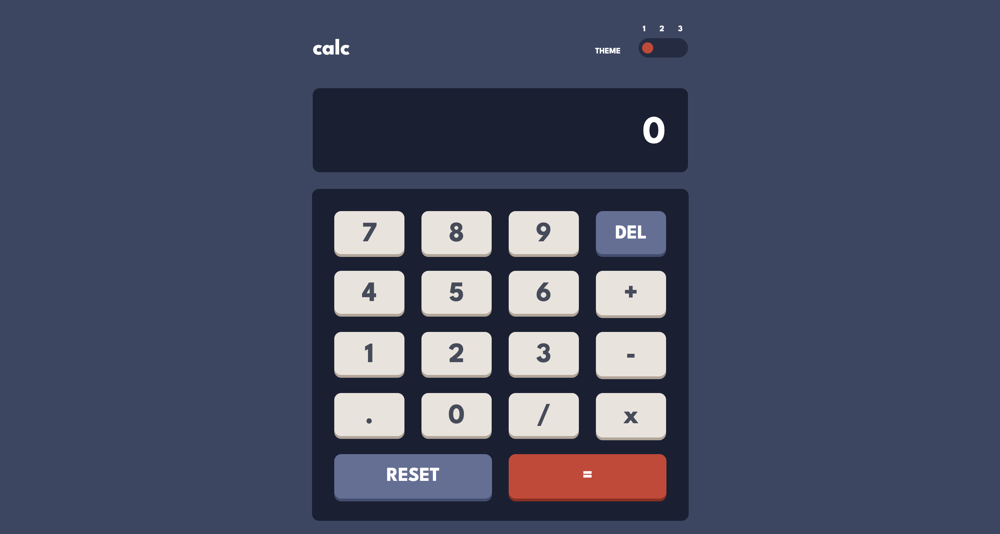

The Calculator project is a dynamic web application built with React, designed to perform basic arithmetic operations with a clean, interactive interface. It features a responsive design optimized for mobile and desktop, supports theme switching for different visual styles, and includes error handling for invalid inputs like division by zero.

